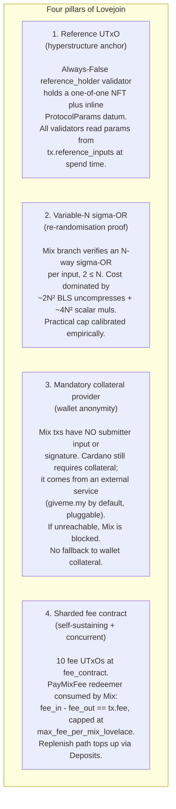
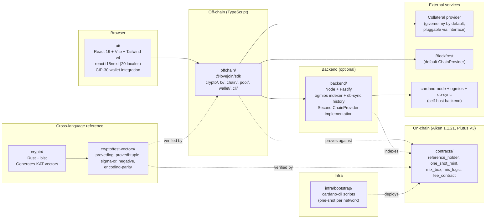

# Architecture

A one-page contributor overview. For full design context read [docs/spec/00-overview.md](docs/spec/00-overview.md) and the rest of [docs/spec/](docs/spec/).

## What it is

Lovejoin is a Cardano-native privacy mixer implementing **Sigmajoin**, an outsourceable variant of Zerojoin, deployed as a **hyperstructure**: the on-chain protocol is permissionless, immutable, and has no operator. Anyone can run a UI, a backend, or trigger a mix.

## The four hyperstructure pillars

Every architectural decision threads through these four ideas. Read the corresponding spec section before changing any of them.



Spec pointers: [03-contracts.md §1](docs/spec/03-contracts.md), [02-cryptography.md "N-way Sigma-OR"](docs/spec/02-cryptography.md), [01-protocol.md "Collateral provider"](docs/spec/01-protocol.md), [03-contracts.md §3](docs/spec/03-contracts.md).

## The three operations

```mermaid
sequenceDiagram
    autonumber
    actor U as User wallet (CIP-30)
    participant SDK as Lovejoin SDK
    participant CN as cardano-node (Preprod)
    participant CP as Collateral provider<br/>(giveme.my)
    participant Pool as Pool (mix_box UTxOs)
    participant Fee as fee_contract<br/>(10 shards)

    Note over U,Fee: DEPOSIT (wallet-signed)
    U->>SDK: pick denom, generate owner secret
    SDK->>SDK: build deposit tx (locks ADA in mix_box;<br/>tops up one fee shard via Replenish)
    SDK->>U: request signature
    U->>CN: submit signed tx
    CN-->>Pool: new mix_box UTxO appears
    CN-->>Fee: shard balance increases

    Note over U,Fee: MIX (fully wallet-anonymous)
    SDK->>SDK: select N pool boxes, build N-way<br/>sigma-OR proofs, bind to tx.outputs hash
    SDK->>CP: request collateral UTxO + witness
    CP-->>SDK: collateral input + signature
    SDK->>CN: submit Mix tx (no submitter signature;<br/>pays tx.fee from a fee shard)
    CN-->>Pool: N old mix_box UTxOs replaced<br/>by N new indistinguishable ones
    CN-->>Fee: shard balance decreases by tx.fee

    Note over U,Fee: WITHDRAW (Schnorr proof, no box signer)
    U->>SDK: choose box, derive Schnorr proof<br/>from owner secret bound to tx.outputs hash
    SDK->>U: request signature on payment tx
    U->>CN: submit (proof spends the box)
    CN-->>Pool: mix_box consumed; ADA leaves the pool
```

After `k` mixes at width `N`, an outsider's chance of correctly mapping a deposit to its withdrawal is `(1/N)^k`. Privacy comes from chaining mixes.

## Component layout



| Workspace                                                                                  | Language                                   | Purpose                                                                                   |
| ------------------------------------------------------------------------------------------ | ------------------------------------------ | ----------------------------------------------------------------------------------------- |
| [contracts/](contracts/)                                                                   | Aiken 1.1.21                               | Validators (`reference_holder`, `one_shot_mint`, `mix_box`, `mix_logic`, `fee_contract`)  |
| [offchain/](offchain/)                                                                     | TypeScript                                 | SDK: prover, tx builder, ChainProvider abstraction, CIP-30 wallet, collateral client, CLI |
| [backend/](backend/)                                                                       | TypeScript (Node + Fastify)                | Self-hosted ChainProvider: ogmios chainsync indexer + db-sync history + REST API          |
| [ui/](ui/)                                                                                 | TypeScript (React 19 + Vite + Tailwind v4) | User-facing app; 20 locales; talks to SDK only                                            |
| [crypto/](crypto/)                                                                         | Rust (`blst`)                              | Reference impl; generates cross-language KAT vectors in `crypto/test-vectors/`            |
| [infra/bootstrap/](infra/bootstrap/)                                                       | Shell + cardano-cli                        | One-shot per-network deployment scripts                                                   |
| [integration-tests/](integration-tests/), [stress-tests/](stress-tests/), [bench/](bench/) | TypeScript                                 | Preprod harnesses driven via Blockfrost                                                   |
| [config/](config/)                                                                         | JSON                                       | Per-network parameters baked into the on-chain reference UTxO at bootstrap                |

Workspace tool: **pnpm 10**. Top-level [Makefile](Makefile) is the canonical entry point. `make help` lists every target.

## ChainProvider abstraction

Everything that talks to chain (SDK, UI, integration tests, stress tests, backend itself) goes through the [`ChainProvider`](offchain/src/chain/provider.ts) interface: `submitTx`, `getUtxos`, `awaitConfirmation`, `getReferenceUtxo`, `getProtocolParams`. Two implementations exist:

- [`BlockfrostProvider`](offchain/src/chain/blockfrost.ts): the default, drives the alpha.
- The self-hosted backend ([backend/src/indexer](backend/src/indexer) + [backend/src/api](backend/src/api)).

They are runtime-swappable via `network.<net>.json`'s `provider` block. **Implication for new code:** never call Blockfrost directly. Add capabilities to `ChainProvider` and let the backend grow a matching implementation.

## Cross-language ground truth

The cryptography lives in three independent implementations: TypeScript (proves and verifies), Aiken (verifies on-chain), Rust (reference). The Rust impl generates **KAT vectors** in [crypto/test-vectors/](crypto/test-vectors/); each vector must verify byte-exact in all three. Negative vectors must be rejected by all three. This catches the silent killer of multi-language crypto: encoding drift.

Specifically, the Fiat-Shamir challenge is computed in **both** TS (when proving) and Aiken (when verifying). A one-byte CBOR difference silently fails every proof on chain. See [docs/spec/12-build-guide.md "Risk 1"](docs/spec/12-build-guide.md) for the parity-test discipline.

## Where to go next

- **Implementers:** [docs/spec/01-protocol.md](docs/spec/01-protocol.md), [02-cryptography.md](docs/spec/02-cryptography.md), [03-contracts.md](docs/spec/03-contracts.md), in order.
- **Auditors:** [docs/spec/08-threat-model.md](docs/spec/08-threat-model.md) first, then [03-contracts.md](docs/spec/03-contracts.md) and [02-cryptography.md](docs/spec/02-cryptography.md).
- **First-time contributors:** [CONTRIBUTING.md](CONTRIBUTING.md), then [docs/spec/12-build-guide.md](docs/spec/12-build-guide.md) for the practical pitfalls.
- **Working in Claude Code:** [CLAUDE.md](CLAUDE.md) is the conventions and gotchas reference.
