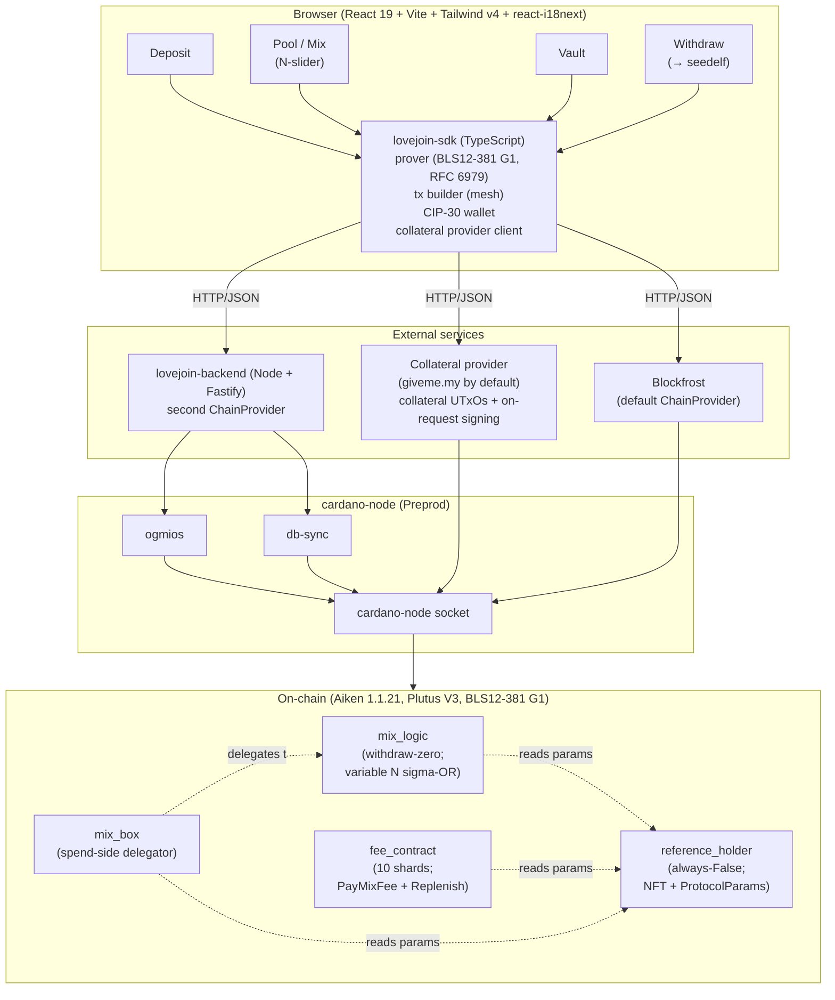

# 00 — Overview

## What we're building

A Cardano-native, non-custodial coin mixer based on **Sigmajoin** (Saxena et al.), built as a **hyperstructure**: the on-chain protocol is permissionless and immutable. The system consists of:

- A **`reference_holder`** validator (always-False) holding a single permanent UTxO with the protocol NFT and an inline datum carrying all protocol parameters. The hyperstructure anchor.
- A **`mix_box`** validator protecting each pooled UTxO. Owner spends via Schnorr proof (no signer key required); anyone mixes via **N-way sigma-OR proof** for variable N (`2 ≤ N ≤ max_n`). Parameters read from the reference UTxO at spend time.
- A **`fee_contract`** validator: a shared pool of ADA, sharded across ~10 long-lived UTxOs for concurrency. Two redeemer paths: `PayMixFee` (consumed by Mix txs, capped at `MAX_FEE_PER_MIX`) and `Replenish` (used by Deposits to top up shards). Self-sustaining; each deposit funds `N_rounds × MAX_FEE_PER_MIX` lovelace.
- **Collateral provider integration** ([Collateral-Provider / giveme.my](https://github.com/logical-mechanism/Collateral-Provider)) so Mix txs need no wallet input from the submitter — the provider's wallet is the collateral source, anonymous to the submitter.
- A **TypeScript off-chain library** that builds Deposit / Mix / Withdraw transactions, generates zero-knowledge proofs (with RFC 6979 deterministic nonces), integrates with CIP-30 wallets via mesh, and talks to the collateral provider.
- A **backend indexer** that watches the script addresses via ogmios and serves pool + fee state via a small REST API; uses db-sync for historical queries.
- A **React + Tailwind UI** with i18n from day one, that lets a user deposit, monitor mix progress, withdraw, and **act as a mixer** for others (a single button: "Mix N random pool boxes," with N user-selectable from the slider).

In v1 every user is implicitly a mixer when they choose. No dedicated mixer-bot service; deferred to M8+.

## Why Sigmajoin (full N-way, not Zerojoin-shaped)

Zerojoin requires both parties online to mix and operates strictly on 2-input/2-output txs. Sigmajoin removes the synchrony requirement AND generalizes to N-input/N-output mixing for any fixed N (paper §6). The privacy gain is direct: an outsider's chance of mapping a specific input to its output is `1/N` per round, so one N=4 mix is equivalent to two N=2 mixes for privacy purposes — fewer txs, lower total fees.

`max_n` is calibrated at M2 against Cardano's per-tx script-cost limits. Initial bet: `max_n = 6`. The SDK defaults each Mix to the highest N the pool supports.

## Wallet anonymity layer

We do NOT implement stealth withdrawal in v1. Users who want full wallet-side anonymity for the destination of a withdrawal should send funds to a [Seedelf](https://github.com/logical-mechanism/Seedelf-Wallet) address. Lovejoin handles the _pool_ side; Seedelf handles the _wallet_ side. They compose cleanly.

## Goals

In priority order:

1. **Correctness.** The protocol math must be implemented faithfully; proof verification must be exact.
2. **Safety.** Funds must be spendable only by their owner.
3. **Security.** Fiat-Shamir bind every proof to its tx context to prevent malleability and replay.
4. **Privacy.** Indistinguishability under DDH; resistance to deanonymization heuristics.
5. **Optimization.** Maximize Mix tx width within Cardano's per-script limits; sharded fee contract for concurrency; SDK pre-fetches collateral asynchronously.

## Non-goals (v1)

- Confidential amounts.
- Cross-chain.
- Account-model compatibility.
- Custom curves beyond BLS12-381 G1.
- Native asset pools.
- Multi-denomination (single pool until demand).
- Dedicated mixer-bot service.
- Stealth withdraw (use Seedelf).
- Decentralized collateral provider (use giveme.my for v1).
- Mainnet deployment until threat model and external audit are signed off.

## High-level architecture



The on-chain validators read protocol parameters from a single permanent UTxO at the always-False `reference_holder` script, identified by a one-of-one NFT, via `tx.reference_inputs` at every spend.

## Three operations

```mermaid
sequenceDiagram
    autonumber
    actor U as User wallet (CIP-30)
    participant SDK as Lovejoin SDK
    participant CN as cardano-node (Preprod)
    participant CP as Collateral provider
    participant Pool as Pool (mix_box UTxOs)
    participant Fee as fee_contract (10 shards)

    Note over U,Fee: DEPOSIT (wallet-signed)
    U->>SDK: pick denomination, derive owner secret
    SDK->>SDK: build deposit tx (locks ADA into mix_box;<br/>tops up one fee shard via Replenish)
    SDK->>U: request signature
    U->>CN: submit signed tx
    CN-->>Pool: new mix_box UTxO appears
    CN-->>Fee: shard balance increases

    Note over U,Fee: MIX (fully wallet-anonymous)
    SDK->>SDK: select N pool boxes; build N-way<br/>sigma-OR proofs bound to tx.outputs hash
    SDK->>CP: request collateral UTxO + witness
    CP-->>SDK: collateral input + signature
    SDK->>CN: submit Mix tx (no submitter signature;<br/>tx.fee paid from a fee shard)
    CN-->>Pool: N old mix_box UTxOs replaced<br/>by N new indistinguishable ones
    CN-->>Fee: shard balance decreases by tx.fee

    Note over U,Fee: WITHDRAW (Schnorr proof, no box signer)
    U->>SDK: choose box; derive Schnorr proof from<br/>owner secret bound to tx.outputs hash
    SDK->>U: request signature on payment tx
    U->>CN: submit (proof spends the box)
    CN-->>Pool: mix_box consumed; ADA leaves the pool
```

## Reading guide

- Implementers: read [01-protocol.md](01-protocol.md), [02-cryptography.md](02-cryptography.md), [03-contracts.md](03-contracts.md) in order.
- Auditors: jump to [08-threat-model.md](08-threat-model.md) first, then [03-contracts.md](03-contracts.md) and [02-cryptography.md](02-cryptography.md).
- Project planning: [09-milestones.md](09-milestones.md).
